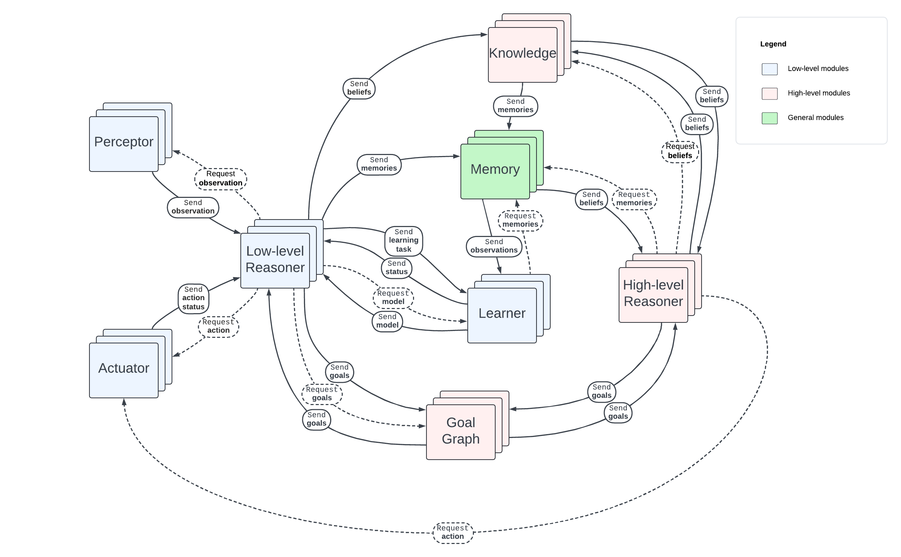

<!-- Generated from README.md by scripts/build_docs.py; edit the README instead. -->

# MHAgentA

**MHAgentA** (Modular Hybrid Agent Architecture) is a Python framework for building
containerized agents from cooperating modules. You define each module's behaviour;
the framework provides state, scheduling, message routing, process lifecycle, and
Docker orchestration. Each module runs in its own process within its agent's
container.

## Installation and prerequisites

Use Python 3.12 or a later version permitted by the project's `^3.12` requirement.
Running experiments requires Docker with Linux container support and an accessible
Docker daemon. `Orchestrator` creates a Docker client during construction. The host
Python installation must also include Tkinter, which is imported with the
orchestrator.

Install the released package into your Python environment:

```shell
python -m pip install mhagenta
```

For development from this checkout, use the existing Poetry dependencies:

```shell
poetry install --with dev
poetry check --lock
poetry run python -c "import mhagenta; print(mhagenta.__version__)"
```

Install the project before importing it: `mhagenta.__version__` comes from installed
distribution metadata. Installing the checkout on the host does not automatically
install that checkout inside agent images; see [Packaging and images](#packaging-and-images).

## Agent structure

An agent can use any subset of the eight module roles, with multiple instances of
each role. At least one module is needed. Modules communicate along the supported
routes shown below.



| Role | Behaviour base in `mhagenta.bases` | Purpose |
| --- | --- | --- |
| Low-level reasoner | `LLReasonerBase` | Fast decisions and reactions to observations and action results |
| Perceptor | `PerceptorBase` | Obtain observations and send them to low-level reasoners |
| Actuator | `ActuatorBase` | Execute requests from reasoners and report results to low-level reasoners |
| Knowledge model | `KnowledgeBase` | Process beliefs and connect reasoning with stored knowledge |
| High-level reasoner | `HLReasonerBase` | Plan, reason about beliefs and goals, and request actions |
| Goal graph | `GoalGraphBase` | Coordinate goal updates between reasoning layers |
| Memory | `MemoryBase` | Store observations and beliefs and supply memories to learners |
| Learner | `LearnerBase` | Process learning tasks and provide models to reasoners |

Some bases have useful default behaviour. `KnowledgeBase.on_observed_beliefs()`
forwards beliefs to all high-level reasoners. `GoalGraphBase.on_goal_update()`
forwards updates from one reasoning layer to all reasoners in the other layer.
Other message hooks normally return their state unchanged; inspect the relevant
base before overriding it.

## A minimal agent

Save this as `example.py`. It runs one periodic reasoner, counts three steps, and
requests an early stop. It uses the internal broker supplied by the agent image;
no separate external RabbitMQ server is needed for this example.

```python
from mhagenta import Orchestrator
from mhagenta.bases import LLReasonerBase
from mhagenta.states import LLState


class Counter(LLReasonerBase):
    def on_init(self, limit: int) -> None:
        self.limit = limit

    def step(self, state: LLState) -> LLState:
        state.count += 1
        self.log(Orchestrator.INFO, f"Count: {state.count}")
        if state.count >= self.limit:
            state.outbox.terminate_agent("Counter completed")
        return state


def main() -> None:
    orchestrator = Orchestrator(
        save_dir="runs/counter",
        step_frequency=1.0,
        agent_start_delay=5.0,
        exec_duration=30.0,
    )
    orchestrator.add_agent(
        agent_id="demo",
        perceptors=[],
        actuators=[],
        ll_reasoners=Counter(
            module_id="counter",
            initial_state={"count": 0},
            init_kwargs={"limit": 3},
        ),
    )
    orchestrator.run()


if __name__ == "__main__":
    main()
```

Run it with `python example.py`, or `poetry run python example.py` when using the
checkout. Use a fresh output directory for the first run. The final module snapshot
is written to `runs/counter/demo/out/demo.counter.json`, and the container log is
saved as `runs/counter/demo.log`.

`add_agent()` requires `perceptors`, `actuators`, and `ll_reasoners` even when a role
is unused: pass an empty list for that role. The other role arguments default to
`None`. Each role accepts a single behaviour instance or a collection; use lists
or tuples for collections. Module IDs must be unique across all roles within an
agent. Agent IDs must be unique within an orchestrator.

## Behaviour hooks and state

All behaviour hooks are synchronous. Keep them short and non-blocking so the
module can process scheduled work and messages. Use the role-specific aliases from
`mhagenta.states`, such as `LLState`, `PerceptorState`, and `ActuatorState`, to get
the appropriate outbox type hints.

| Hook | When it runs | Return value |
| --- | --- | --- |
| `on_init(**kwargs)` | After runtime attachment and any saved-state loading, before execution is scheduled | `None` |
| `on_first(state)` | At execution start, before the first periodic step | Updated or unchanged state |
| `step(state)` | Periodically, if overridden | Updated or unchanged state |
| `on_<message_type>(state, sender, ...)` | When the runtime processes an incoming message | Updated or unchanged state |
| `on_last(state)` | During shutdown, before the final save and communication teardown | Updated or unchanged state |

Leaving `step()` unmodified makes a module reactive: it still receives lifecycle
hooks and messages but has no periodic step action. Pass setup arguments in the
constructor's `init_kwargs` dictionary. `self.state`, `self.agent_id`, and
`self.log()` are available from `on_init()` onward, after the runtime attaches the
behaviour. In the behaviour object's constructor, the agent ID is still `None`
and runtime state and logging are not yet attached.

Declare persistent fields in `initial_state`. For example, `{"count": 0}` registers
`state.count`, also accessible as `state["count"]`. Updating an existing field
preserves its registration. Assigning a new attribute or bracket key does **not**
register it for saving or bracket lookup; use `state.load(new_field=value)` to add
registered fields later. Avoid names belonging to the state's runtime properties,
methods, or private attributes.

The runtime also exposes:

- `state.agent_id` and `state.module_id` for identity.
- `state.time` for seconds since the scheduled execution start. It can be `None`
  before scheduling or negative before that start time.
- `state.directory.internal` for module cards grouped by role, ID, or tags.
- `state.directory.external` for configured agents and environments.
- `state.outbox` for queued internal messages and termination requests.

## Internal messages and directories

Outbox methods enqueue messages. After a hook returns its state, the runtime sends
them through the registered routes and clears the queue. Request methods do not
wait for replies; replies arrive through later message callbacks.

For example, a low-level reasoner can forward beliefs extracted from an
observation to every knowledge module in its agent:

```python
from mhagenta import Belief, Observation
from mhagenta.bases import LLReasonerBase
from mhagenta.states import LLState


class BeliefReasoner(LLReasonerBase):
    def on_observation(
        self, state: LLState, sender: str, observation: Observation, **kwargs
    ) -> LLState:
        beliefs = [Belief(predicate="observed", arguments=(observation.content,))]
        for knowledge in state.directory.internal.knowledge:
            state.outbox.send_beliefs(
                knowledge_id=knowledge.module_id,
                observation=observation,
                beliefs=beliefs,
            )
        return state
```

This callback requires a topology with a perceptor sending observations and
knowledge modules receiving beliefs. Other common pairs include
`request_observation()` / `PerceptorBase.on_request()`,
`request_action()` / `ActuatorBase.on_request()`, and
`send_status()` / `LLReasonerBase.on_action_status()`.

Directory lookups return cards. Internal cards expose `module_id`, `module_type`,
and `tags`; external cards expose `agent_id` (also used for environment IDs), `id`,
`address`, and `tags`. String keys select exact IDs and integer keys select by
registration order. `search(["tag_a", "tag_b"])` selects cards containing **both**
tags; pass a reusable collection of tags. Empty tag collections match all entries.

The external directory is populated when `mas_rmq_uri` is configured. Its RabbitMQ
addresses contain `host`, `port`, `exchange_name`, and `agent_id` or `env_id`.
`.environments` returns all environment cards; `.environment` returns the first,
or `None`. Select an environment by ID or tags when more than one is registered.
These entries describe configured entities, not live service discovery.

## RabbitMQ environments and external messages

An environment behaviour extends `MHAEnvBase` and uses a plain state dictionary.
Its `init_state` argument is required; pass `None` for an empty dictionary.
`Orchestrator.add_environment()` wraps that behaviour in an `RMQEnvironment`.

```python
from mhagenta import Orchestrator
from mhagenta.environment import MHAEnvBase


class CounterWorld(MHAEnvBase):
    def on_observe(self, state, sender_id, **kwargs):
        return state, {"value": state["value"]}

    def on_action(self, state, sender_id, **kwargs):
        state["value"] += kwargs.get("increment", 1)
        return state, {"value": state["value"]}


def configure_world() -> Orchestrator:
    orchestrator = Orchestrator(
        save_dir="runs/world",
        mas_rmq_uri="default",
        mas_rmq_exchange_name="world-exchange",
        stop_on_agents_term=True,
    )
    orchestrator.add_environment(
        base=CounterWorld(init_state={"value": 0}),
        env_id="world",
        host="localhost",
        port=5672,
        exchange_name="world-exchange",
    )
    return orchestrator
```

This registers the environment; add agents before running the returned
orchestrator. Agents interact with it through subclasses of `RMQPerceptorBase`
and `RMQActuatorBase`, available from `mhagenta.defaults.communication`. Configure
both with `exchange_name="world-exchange"` and the same broker. Their constructors
also take the usual `module_id`, `initial_state`, and `init_kwargs` arguments.
Supply `tags` as a list when using these external communication bases.

- A perceptor calls `self.observe(env_id="world", ...)`. The request fields become
  keyword arguments to `on_observe()`, which returns `(state, response_dict)`.
  Response fields arrive in the perceptor's `on_observation(state, env_id, **kwargs)`.
- An actuator calls `self.act(env_id="world", ...)`. The request fields become
  keyword arguments to `on_action()`. Returning `state` or `(state, None)` sends no
  response. Returning `(state, response_dict)`, including `(state, {})`, invokes
  the actuator's `on_status(state, env_id, **kwargs)` when the reply arrives.
- These external helpers publish through their connector immediately and return
  without waiting. Their response hooks must return the module state. To forward
  a result to a reasoner, construct an `Observation` or `ActionStatus` and use the
  internal outbox.

Omitting `env_id` selects the first external environment card and requires that
card to exist. Selecting an ID does not change the helper's configured broker or
exchange. Use explicit matching exchange names throughout: the environment and
the perceptor/actuator defaults differ.

Environment replies are routed by agent ID and response kind. Multiple perceptors
or actuators subscribed to the same reply route receive those replies. Include and
echo your own correlation fields when matching responses to individual requests.

For communication between agents, use `RMQSenderBase.send(recipient_id, msg)` and
override `RMQReceiverBase.on_message(state, sender, msg)` to return a state. The
recipient is an **agent ID string**, not its address dictionary. Both endpoints
must use the same broker and exchange. Sending adds a `sender` field to the supplied
dictionary. RabbitMQ messages are serialized with `dill`, so both sides need the
Python definitions used by their payloads.

`mas_rmq_uri="default"` uses a broker at `localhost:5672` and attempts to launch a
RabbitMQ management container if a connection cannot be established. A custom
address uses `host:port` syntax. The environment startup script also checks the
broker's HTTP management endpoint at the configured AMQP port plus 10000,
normally 15672. The orchestrator maps external `localhost` connections inside
containers to the host gateway.

## Timing, shutdown, and persistence

Parameters named `step_frequency` and `status_frequency` are **intervals in
seconds**, not rates in hertz. The orchestrator defaults are 1 second for steps and
5 seconds for status reports. `control_frequency` bounds the idle scheduling wait;
its default of `-1` introduces no positive wait.

`agent_start_delay` defaults to 60 seconds from the start of `run()`/`arun()`.
Execution waits for module readiness. Each agent can add a `start_delay` offset.
When supplying a complete Unix `exec_start_time`, set `agent_start_delay=0` to avoid
adding the global delay to that timestamp. `exec_duration` is the agent's execution
time limit. Environment durations are adjusted by the orchestrator for startup
timing and are not the same as a module's execution clock.

To finish early, call `state.outbox.terminate_agent(reason)` in the hook that detects
completion and return the state. The runtime processes the request even with an
otherwise empty outbox, and the root coordinates shutdown. Use `on_last()` for
final bookkeeping; it already runs during shutdown. `module_term_timeout` controls
the grace period for each module process to exit. With `stop_on_agents_term=True`,
the orchestrator requests environment shutdown once all agent containers exit.

Module snapshots contain `state.dump()`: only registered custom fields. The
directory, clock, and outbox are runtime information. Saving uses JSON by default;
choose `save_format="dill"` for Python objects that the standard JSON serializer
cannot encode. Save failures are logged as warnings.

| `state_autosave_interval` | Module saving behaviour |
| --- | --- |
| `-1` (default) | Final save after `on_last()` |
| `0` | Save each processed behavioural state update, plus the final save |
| Positive number | Periodic saves at that interval in seconds, plus the final save |

Module files are `<save_dir>/<agent_id>/out/<agent_id>.<module_id>.json` or `.sav`.
Saving writes a temporary file, preserves the previous primary as `.backup`, and
replaces the primary. `resume=True` loads saved custom fields before `on_init()`;
it tries the backup if the primary cannot be loaded. Loading merges fields, so new
initial fields absent from the snapshot remain. If neither snapshot can be loaded,
module construction fails.

Environment state is saved separately as `<save_dir>/<env_id>/out/<env_id>.json`
or `.sav` on shutdown. The environment runtime does not provide the module
backup/resume mechanism. With `num_copies > 1`, agent IDs and output directories use
suffixes `_0`, `_1`, and so on.

State loading and image/output reuse are separate concerns. An existing image
retains its serialized configuration, including `resume`. Rebuilding with
`force_run=True` can delete an existing entity output directory and its snapshots,
even when no old container exists. Preserve snapshots needed for resuming before
using that option.

## Packaging and images

Use the `add_agent()` and `add_environment()` packaging options for dependencies:

- `requirements_path`: a requirements file installed with `pip install -r` inside
  the image.
- `init_script`: a shell script executed with `sh` during image building, before
  the requirements file is installed. Use it for system dependencies.
- `extra_runtime_sources`: local standalone `.py` files or importable package
  directories containing `__init__.py`. Pass a package directory instead of its
  `__init__.py` or a nested module file. Sources are copied beneath `/agent` and
  must not conflict with launcher files or automatically copied behaviour sources.

The builder copies local source associated with behaviour classes. Additional
local packages used by those classes may still need `extra_runtime_sources`;
third-party dependencies belong in `requirements_path`. Files placed only in the
host environment are not automatically installed in a container.

`run()` and `arun()` rebuild agent and environment images by default. Setting
`rebuild_agents=False` or `rebuild_envs=False` requires existing images and reuses
their embedded configuration and sources. Rebuild after changing those inputs.
`keep_containers=True` retains stopped agent/environment containers after normal
completion; host-mounted output files are separate from container retention.

`mhagenta_version` selects the **base image tag**. `local_build` accepts the path to
a framework checkout containing `mhagenta/`, `pyproject.toml`, and `README.md`.
For development, use an unused base-image tag and `prerelease=False` with
`local_build`: a cached matching base image can bypass the local build, and the
prerelease installation branch takes precedence over local installation.

The orchestrator and each entity also accept `gpu_device_ids`: `'none'`, `'all'`,
`'any'`, or explicit device IDs. Agents inherit the orchestrator's setting when
their value is `None`; environments default to `'none'` and inherit only when
explicitly given `None`. GPU execution requires a compatible Docker host.

## Async use and extension points

`orchestrator.run()` owns its event loop. From an existing event loop, use
`await orchestrator.arun(...)` with the same options. Image preparation still uses
synchronous Docker operations before the container tasks start.

To implement another internal transport, extend
[`Connector`](mhagenta/core/connection/connector.html). Its docstrings describe
initialization, channel registration, synchronous send methods, callbacks, and
serialization responsibilities. Select it through `connector_cls` and
`connector_kwargs`; the supplied external RabbitMQ behaviour bases retain their
own transport configuration.

The scripts under `mhagenta/core/*_launcher.py`,
`mhagenta/environment/environment_launcher.py`, and `mhagenta/scripts/` are
framework entry points with container paths and generated parameter files. User
experiments should launch through the orchestrator.

## Building the documentation

The [published API reference](https://auron-tliar.github.io/mhagenta/) is hosted
from the `gh-pages` branch. Its pages are generated by pdoc and packaged by MkDocs.
To regenerate them from this checkout, install the documentation dependency group
and run the build script:

```shell
poetry install --with dev,docs
poetry run python scripts/build_docs.py
```

The script updates the generated pages under `docs/` and builds the complete site
in `build/site/`. Preview it with `poetry run mkdocs serve`. Regenerate after
changing docstrings; MkDocs alone only packages the existing API HTML.

After reviewing the build, publish with `poetry run mkdocs gh-deploy --strict`.
This updates `gh-pages` without switching the current checkout to that branch.
Commit source and generated-page changes separately on the development branch.
